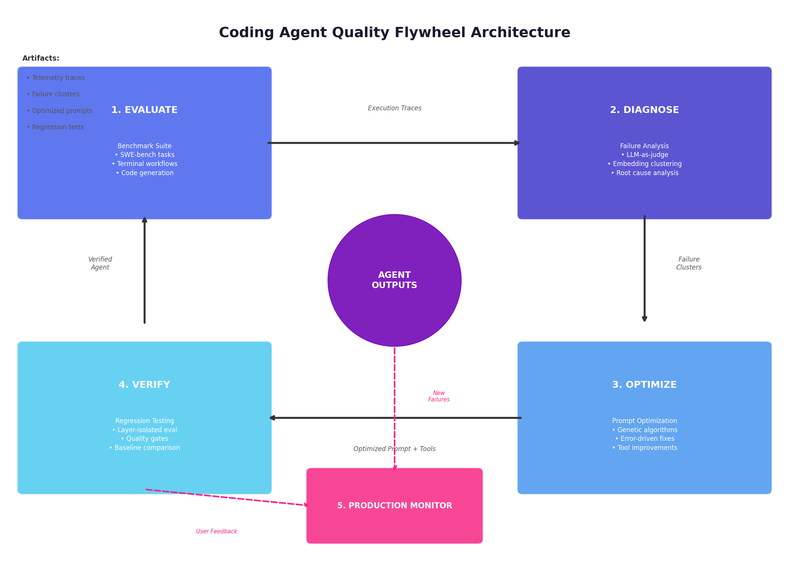

# Kimi Coding Agent Flywheel

## Current scope

The worker provides one supported command-line workflow: load selected runs
from an Agent Quality SQLite database, redact the diagnosis prompt, invoke an
explicit judge command, cluster diagnosed failures, and persist versioned
analysis results.

The package also contains Python APIs for benchmark models, telemetry,
optimization experiments, regression data, and production-monitoring data.
Those modules are useful building blocks, but they are experimental APIs rather
than additional CLI commands. In particular, the built-in programmatic and LLM
benchmark evaluators and the regression executor are scaffolds; applications
must supply real execution and evaluation integrations before using them as a
release gate.

## Installation

From `kimi_coding_agent_flywheel/`:

```bash
python -m pip install -e .
```

The distribution installs the `kimi_coding_agent_flywheel` package and the
`aq-flywheel` console command.

## Supported CLI

### Analyze Agent Quality runs

```bash
aq-flywheel analyze \
  --db /path/to/quality.sqlite3 \
  --run-id run_one \
  --run-id run_two \
  --min-cluster-size 2 \
  --judge-command-json '["python", "/path/to/judge.py"]' \
  --judge-timeout 120
```

The equivalent module invocation is:

```bash
python -m kimi_coding_agent_flywheel.cli analyze \
  --db /path/to/quality.sqlite3 \
  --run-id run_one \
  --judge-command-json '["python", "/path/to/judge.py"]'
```

`--judge-command-json` must be a JSON array of non-empty command arguments. The
worker starts the command without a shell, writes the redacted diagnosis prompt
to standard input, and reads the JSON response from standard output.

The judge response must have this shape:

```json
{
  "overall_score": 4.0,
  "failures": [
    {
      "subcategory": "skipping_validation",
      "severity": "high",
      "description": "The agent did not run the relevant tests.",
      "root_cause": "The workflow omitted an explicit verification step.",
      "suggested_fix": "Require targeted tests before completion.",
      "affected_prompt_component": "system_prompt"
    }
  ],
  "summary": "One verification failure was found."
}
```

The command emits JSON-line progress events on standard output. Unknown run IDs
are rejected before an analysis history row is created. A judge failure for one
run is recorded on that analysis input without discarding successful diagnoses
from other selected runs.

There are no `regression`, `gate`, or dashboard CLI subcommands in this
distribution.

## Supported Python imports

Existing facade imports remain stable after the internal module split:

```python
from kimi_coding_agent_flywheel.clustering.failure_analyzer import (
    FailureAnalysisPipeline,
    FailureCategory,
    FailureClusteringEngine,
    FailureInstance,
    LLMJudgeDiagnoser,
)
from kimi_coding_agent_flywheel.core.aq_adapter import AQDbAdapter
from kimi_coding_agent_flywheel.core.benchmark import (
    BenchmarkSuite,
    BenchmarkTask,
    CodingAgent,
    Difficulty,
    TaskId,
    TaskType,
)
from kimi_coding_agent_flywheel.core.telemetry import Trace, Tracer
from kimi_coding_agent_flywheel.optimization.prompt_optimizer import (
    GeneticPromptOptimizer,
    PromptCandidate,
)
from kimi_coding_agent_flywheel.regression.regression_suite import (
    QualityGate,
    RegressionSuite,
)
```

New code may import focused modules directly, for example:

```python
from kimi_coding_agent_flywheel.clustering.diagnosis import LLMJudgeDiagnoser
from kimi_coding_agent_flywheel.clustering.engine import FailureClusteringEngine
from kimi_coding_agent_flywheel.clustering.models import FailureInstance
from kimi_coding_agent_flywheel.eval import Evaluator
```

## Package architecture

The architecture image is a conceptual view of the same evaluate, diagnose,
optimize, verify, and monitor stages; the tree below is the authoritative
current module layout.



```text
kimi_coding_agent_flywheel/
  pyproject.toml
  README.md
  docs/
  tests/
  src/kimi_coding_agent_flywheel/
    cli.py
    clustering/
      taxonomy.py       # Failure categories and shared constants
      models.py         # Diagnosis and cluster result models
      diagnosis.py      # Judge prompt, invocation, and response parsing
      engine.py         # Feature extraction and DBSCAN clustering
      root_cause.py     # Cluster-level analysis and recommendations
      pipeline.py       # Analysis application service and state persistence
      failure_analyzer.py  # Backward-compatible facade
    core/
      benchmark_models.py
      agents.py
      benchmark_suite.py
      benchmark_factories.py
      benchmark.py      # Backward-compatible facade
      telemetry_models.py
      tracing.py
      instrumentation.py
      trace_analysis.py
      telemetry.py      # Backward-compatible facade
      aq_base.py
      aq_ingestion.py
      aq_projection.py
      aq_analysis_store.py
      aq_legacy.py
      aq_adapter.py     # Backward-compatible facade
      flywheel.py
    eval/
      evaluators.py
    optimization/
      models.py
      evaluation.py
      mutations.py
      genetic.py
      error_driven.py
      composite.py
      prompt_optimizer.py  # Backward-compatible facade
    regression/
      models.py
      suite.py
      quality_gate.py
      regression_suite.py  # Backward-compatible facade
    monitoring/
      dashboard.py
```

The facade modules deliberately preserve installed import paths while the
implementation modules keep taxonomy, serialization, orchestration, and
persistence responsibilities separate.

### Migration from the flat package layout

The Python package moved from the project directory into `src/`. No installed
import path changed: imports continue to begin with
`kimi_coding_agent_flywheel`, and the console command remains `aq-flywheel`.
Development tools that relied on importing the checkout without installation
must now install with `python -m pip install -e .` or put `src/` on
`PYTHONPATH`. The included pytest configuration handles this automatically.

## Data and privacy behavior

- Run prompts and source events are loaded from the Agent Quality database.
- Diagnosis prompts pass through Agent Quality redaction immediately before
  judge invocation.
- Analysis runs, per-run statuses, failure instances, clusters, and memberships
  are persisted in SQLite.
- Cluster/result persistence is transactional.
- The worker should be pointed at local Agent Quality data; captured payloads
  and runtime data must not be committed to source control.

## Development

Use the repository virtual environment. From the repository root:

```bash
PYTEST_DISABLE_PLUGIN_AUTOLOAD=1 \
  ~/venvs/quality-flywheel/bin/python -m pytest \
  kimi_coding_agent_flywheel/tests
```

From `kimi_coding_agent_flywheel/`:

```bash
PYTEST_DISABLE_PLUGIN_AUTOLOAD=1 \
  ~/venvs/quality-flywheel/bin/python -m pytest
```

The project configuration adds `src/` to the test import path, so both commands
exercise the same installed package layout. A packaging smoke test should also
verify the console-script entry point after an editable install.
